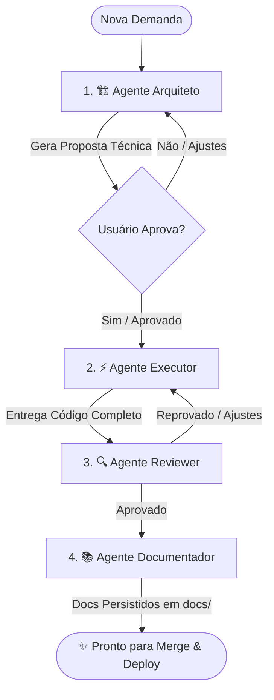

# 🤖 Agentes Especialistas & Skills - Stack Python (FastAPI + SQLAlchemy 2.0 + Vue 3)

Este diretório contém a suíte de agentes especialistas e skills de engenharia de software configurados especificamente para a stack **`Python 3.12+ / FastAPI / SQLAlchemy 2.0 Async / Vue 3`**.

---

## 👥 Agentes Disponíveis

| Agente | Arquivo | Função Principal |
| :--- | :--- | :--- |
| **🏗️ Agente Arquiteto** | [`AGENTE_ARQUITETO.md`](./AGENTE_ARQUITETO.md) | Analisa demandas, planeja o modelo de dados (SQLAlchemy 2.0 Async / Alembic), rotas REST (FastAPI), schemas Pydantic V2, jobs assíncronos (Celery/Redis) e interfaces Vue 3. **Bloqueia execução até aprovação.** |
| **⚡ Agente Executor** | [`AGENTE_EXECUTOR.md`](./AGENTE_EXECUTOR.md) | Escreve código de produção 100% completo, tipado (Python 3.12+ Type Hints), modular (Clean Architecture) e funcional em FastAPI e Vue 3, sem omissões. |
| **🔍 Agente Reviewer** | [`AGENTE_REVIEWER.md`](./AGENTE_REVIEWER.md) | Audita segurança (OWASP), concorrência/asyncio, N+1 no SQLAlchemy, schemas Pydantic V2, tratamento de exceções e boas práticas antes do merge. |
| **📚 Agente Documentador** | [`AGENTE_DOCUMENTADOR.md`](./AGENTE_DOCUMENTADOR.md) | Gera e mantém a documentação técnica, docstrings (Google Style), documentação OpenAPI/Swagger e guias no diretório `docs/`. |

---

## 📐 Skills Disponíveis

- **`fastapi-architecture`** ([`skills/fastapi-architecture/SKILL.md`](./skills/fastapi-architecture/SKILL.md)): Padrões arquiteturais para Clean Architecture em Python 3.12+, FastAPI, SQLAlchemy 2.0 Async, Pydantic V2, Celery (Redis), criptografia AES-256-GCM, Vue 3 e regras rígidas de isolamento de banco em testes.

---

## 🔄 Ciclo de Desenvolvimento Recomendado

